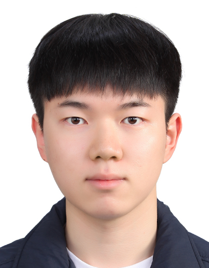

# Max Kim's User Page

## Introduction
Hi! I'm __Max Kim__, a Computer Science student at the University of California, San Diego (UCSD). I'm passionate about __Parallel Programming__ and __Web Development__.

## Profile and Contact Me

- __Full Name__: Max Kim
- __Email__: [gyk002@ucsd.edu](mailto:gyk002@ucsd.edu)
- __Phone__: +1 (858) 214-6689
- __GitHub__: [Max Kim's GitHub](https://github.com/Max010123e0)
- __LinkedIn__: [Max Kim's LinkedIn](https://www.linkedin.com/in/max-kim-786738180/)

## Education
### Academic History
- **BS in Computer Science** *(2021-2022, 2025~)*  
  *University of California, San Diego*  

- **Associate Degree in Computer Science** *(2019-2021)*  
  *Diablo Valley College*  

- **High School Diploma** *(2016-2019)*  
  *Sangsan High School*  

## Skills
### Programming Languages:
- C++
- HTML, CSS, JavaScript
- Python, Java

### Tools & Technologies:
- Android Studio
- OpenCL, CUDA
- Linux

### Core Concepts:
1. Algorithm Design
2. Data Structures
3. Parallel Computing
4. Android/Web Development

## Experience

### Mandatory Military Service – Republic of Korea Army (2022–2024)
Fulfilled two years of mandatory military service, demonstrating discipline, resilience, and adaptability.

### Intern, Computer Systems and Platforms Laboratory – Seoul National University, Korea (June–September 2020)
Evaluated the performance of OpenCL applications on CPU/GPU cores of integrated processors. Gained hands-on experience with Linux servers, CPU/GPU architectures, and OpenCL.


## Links to Other Pages
- [README](./README.md)

## Section Links
- [Go to Education Section](#education)
- [Go to Skills Section](#skills)
- [Go to Experience Section](#experience)

## Task List

Here is a List that I'm currently working on

- [x] Complete the User Page
- [ ] Learn what the Softeware Engineering is
- [ ] Succeed the CSE110 Course

## Quote of Text about Softeware Engineering
> "Tool syntax problems are the easy predictable part of software engineering and while they are challenging their value is time limited compared to deeper harder lessons in thinking and people." — Thomas A. Powell

## This will be the code that u must used the most 
```
git push origin main
```